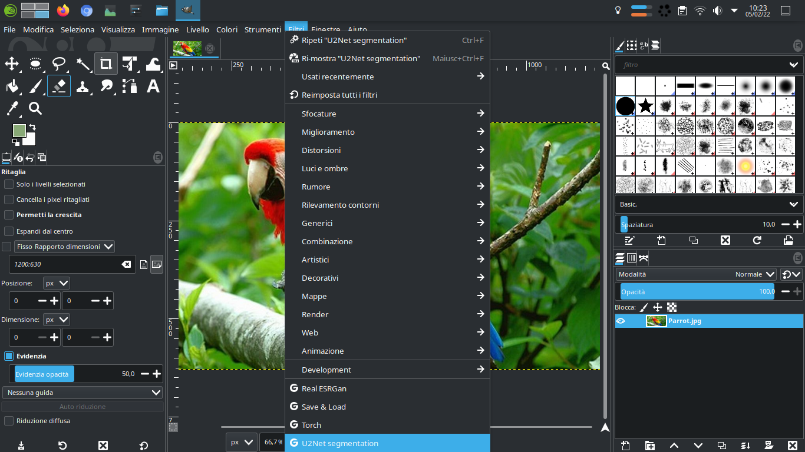
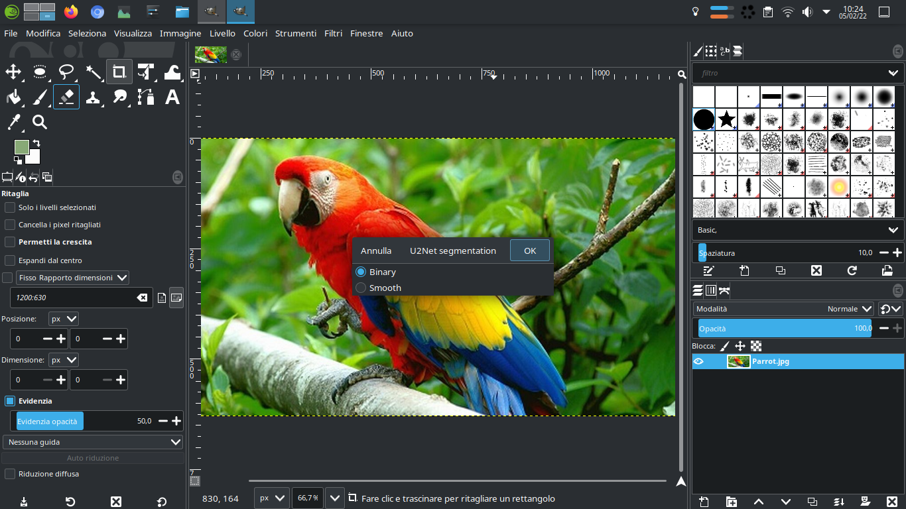
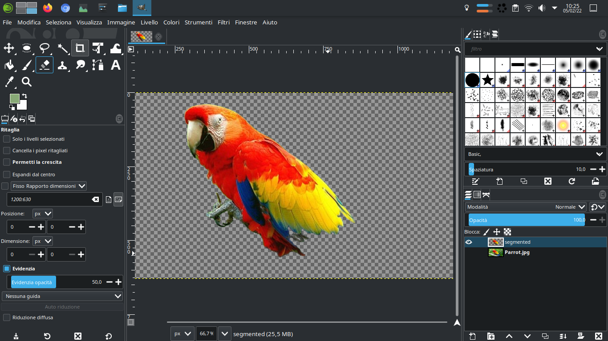

# U<sup>2</sup>-Net GIMP Plugin
A plugin for GIMP that use [U<sup>2</sup>-Net](https://github.com/xuebinqin/U-2-Net) for segmentation, you can try a demo on [HuggingFace Spaces](https://huggingface.co/spaces/xiongjie/u2net_rgba).

## Usage
|step1: select the filter|sep2: select the mode and click ok|step3: hide the starting layer |
|---|---|---|
||||

## Installation
1. Clone repo into your GIMP plugin folder (requires GIMP 2.99.* or greater)

    ```bash
    # cd into GIMP folder 
    # for example: cd ~/.var/app/org.gimp.GIMP/config/GIMP/2.99/plug-ins
    # or: cd .config/GIMP/2.99/plug-ins/
    # (if you do not know the pat you can Open GIMP, go to Edit -> Preferences -> Folders -> Plug-Ins and see the folder/path listed.)
    git clone https://github.com/nicolalandro/u2net_gimp_plugin.git
    cd u2net_gimp_plugin
    chmod +x u2net_gimp_plugin.py
    ```
2. Install dependent packages

    ```bash
    #cd u2net_gimp_plugin
    flatpak run --command=bash org.gimp.GIMP//beta
    python -m ensurepip
    python -m pip install --upgrade pip

    python -m pip install -r requirements.txt
    ```
3. Download pretrained models

    ```bash
    #cd u2net_gimp_plugin
    wget https://github.com/nicolalandro/u2net_gimp_plugin/releases/download/0.1/u2net.onnx
    ```

## Dev
Test script without GIMP:
```
pip install -r requirements
python3.8 inference.py
```

|input|result|
|---|---|
|||
